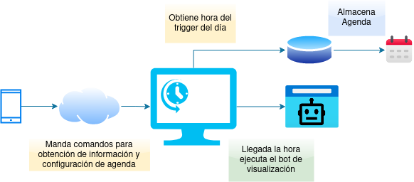

# TwitchViewer

Auto-recolector de recompensas de Twitch , auto-gestionado mediante la configuración de la agenda de un streamer, abierto a recibir comandos vía chat (telegram).

## Descripción

Proyecto realizado con la finalidad de entender sobre el funcionamiento de los bots expuestos en chats como telegram. Y sobre la interacción de páginas web a través de la automatización de navegadores web como lo logra [selenium](https://www.selenium.dev/).

En términos generales, el proyecto cuenta con la capacidad de recolectar las recompensas emitidas en un stream de Twitch. Mediante el uso de un scheduler, se realiza una configuración inicial con la agenda de un streamer y este lanzará una instancia de un [webdriver de selenium](https://www.selenium.dev/documentation/webdriver/), se logueará a la cuenta especifícada, visitará el stream específicado y comenzará a recolectar los puntos lanzados cada cierto periodo de tiempo que requieren un click para reclamarlos, al término del stream saldrá de la cuenta y esperará a su próximo lanzamiento según sea especificado en la agenda.



Inicialmente la base de datos de la agenda es populada con todos los días de la semana y con los disparadores de hora en 0. Ejemplo:

```json
{
    "schedule": {
        "1": { "name": "Sunday", "startAt": 0, "endAt": 0 },
        "2": { "name": "Monday", "startAt": 0, "endAt": 0 },
        "3": { "name": "Tuesday", "startAt": 0, "endAt": 0 },
        "4": { "name": "Wednesday", "startAt": 0, "endAt": 0 },
        "5": { "name": "Thursday", "startAt": 0, "endAt": 0 },
        "6": { "name": "Friday", "startAt": 0, "endAt": 0 },
        "7": { "name": "Saturday", "startAt": 0, "endAt": 0 }
    }
}
```

La configuración de la agenda está pensada que se realice mediante el chat habilitado haciendo uso de los [comandos disponibles](#comandos).

## Para comenzar

#### Dependencias

La instalación de las dependencias se encuentra cubierta en `requirements.txt`, sin embargo a continuación se presenta un listado del las librerías "stand-alone" empleadas, las cuales pueden ser instaladas con `pip` una a una:

```
python-dotenv
pyTelegramBotAPI
tinydb
webdriver-manager
selenium
```

### Instalación y configuración


- Clonación de repositorio e instalación de dependencias.

```
git clone https://github.com/srrequiem/TwitchViewer.git
cd TwitchViewer
pip install -r requirements.txt
```

- Basándose en el archivo `.env.example` es necesario crear el archivo `.env` el cuál será utilizado por el bot para lograr su objetivo.

- Es necesario [dar de alta un bot en telegram](https://core.telegram.org/bots#3-how-do-i-create-a-bot) del cuál se obtendrá el token de autenticación, cuyo valor deberá ser colocado en la variable `TELEGRAM_TOKEN` del archivo `.env`. Aquí ya se podrá entablar un chat con el bot creado.

- Ejecutar el script `setup.py` y mandar el comando `/start` en telegram para obtener el ID del chat personal para colocar en la variable `TELEGRAM_CHAT_ID` del archivo `.env`.

```
python setup.py
```


- Si la cuenta de twitch a utilizar tiene deshabilitado el factor doble de autenticación cambiar la variable `FA_ENABLE` del archivo `.env` a `false`.

- Terminar de llenar los variables restantes del archivo `.env`. Donde:
  - `USER` - es usuario de la cuenta.
  - `PASSWORD` - es la contraseña de la cuenta.
  - `STREAMER` - cuenta del stream a observar, obtenida de `https://twitch.tv/<STREAMER>`

### Ejecución

```
python bot.py
```

#### Ejecución indefinida

- Si así se desea ejecutar indefinidamente se puede configurar un crontab para contemplar su ejecución después del reinicio.

```
crontab -e
```

- Añadir entrada en la edición.

```
@reboot python /ubicacion/de/bot &
```

- Ejecutar reinicio para iniciar.

```
sudo reboot
```

## Comandos

| Comando | Descripción |
|---|---|
| **/start** | Envía listado de comandos disponibles. |
| **/help** | Envía listado de comandos disponibles. |
| **/launch** | Ejecuta acción de visualización sin considerar agenda. |
| **/getschedule** | Envía configuración actual de agenda. |
| **/setdayschedule** | Cambia configuración de un día en específico, ejemplo: `/setdayschedule Monday 15:00-15:30.` |
| **/setschedule** | Cambia configuración de múltiples días, ejemplo: `/setschedule Monday=15:00-15:30,Tuesday=15:00-15:30...` |

## Alcance

- [ ] Contemplar horario de inicio y fin de stream entre días, es decir, inicio 11:00 p.m. fin 3:00 a.m. de día siguiente.
- [ ] Comando `/launch` para forzar visualización de stream sin considerar agenda.
- [ ] ¿Comando `/status` para visualizar cuanto falta para próxima ejecución?
- [ ] Escribir en base de datos log de eventos de estatus (inicio, recolección y termino).
- [ ] Habilitar lectura de logs mediante configuración local y mediante bot de telegram.
- [ ] Mejorar manejo de objetos.
- [ ] Ajuste a nombre de propiedades públicas y privadas de objetos.
- [ ] Correcto manejo de excepciones.
- [ ] Consideración de diccionarios para multilenguaje.
- [ ] Deploy multiplataforma.
